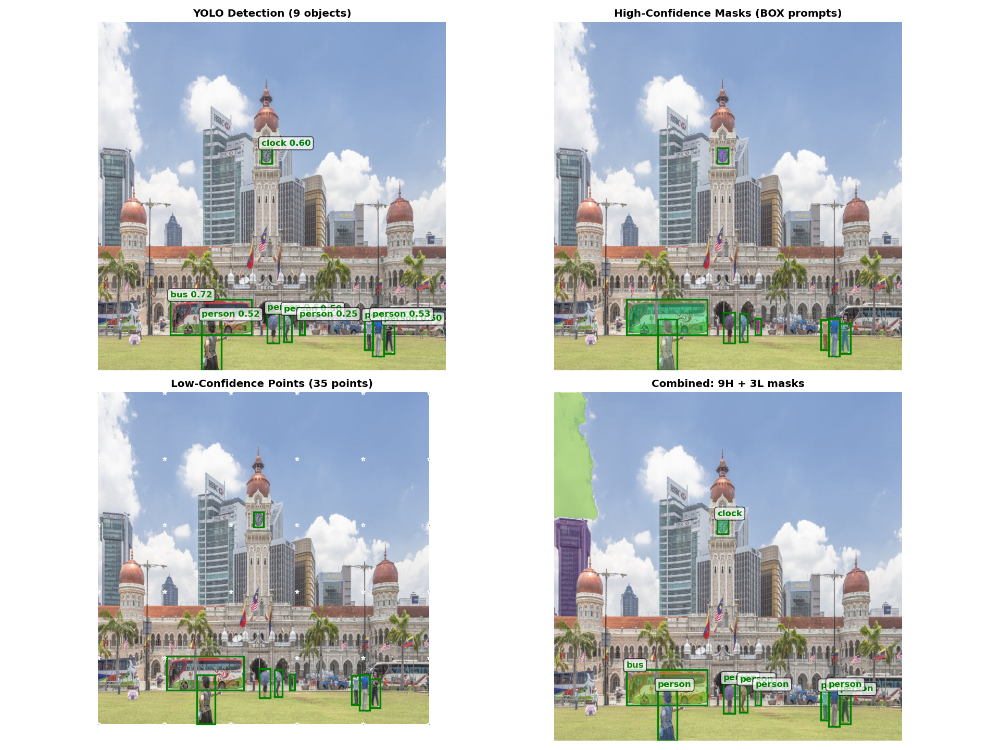

# TinySAM + YOLO Integration

## Overview

This repository extends **TinySAM** with **YOLO integration** to achieve **77x faster segmentation** while maintaining high quality. Our hierarchical pipeline combines YOLOv8n for object detection with TinySAM for instance segmentation.

### Key Results
- **Speed**: 2.01 FPS vs 0.03 FPS (77.1x faster than hierarchical everything)
- **Quality**: Mean IoU 0.9411 vs 0.9360 (0.5% improvement)
- **Efficiency**: 77.5x better speed-quality trade-off
- **Model Size**: Only 13.29M parameters (YOLOv8n 3.16M + TinySAM 10.13M)

### Visual Results

Our hierarchical pipeline combines YOLO detection with TinySAM segmentation in two layers:

<div align="center">
  
  <p><i>Demonstration of our two-layer hierarchical segmentation: (Top-left) YOLO detects 9 objects, (Top-right) High-confidence masks from box prompts, (Bottom-left) Low-confidence sampling with 35 dense points, (Bottom-right) Combined result with 9 high-quality + 3 low-confidence masks covering the entire scene.</i></p>
</div>

## Quick Start

### Installation
```bash
pip install torch torchvision matplotlib opencv-python ultralytics
```

### Download Models
```bash
# TinySAM checkpoint
wget https://github.com/xinghaochen/TinySAM/releases/download/3.0/tinysam_42.3.pth -P weights/

# YOLO will auto-download on first use
```

### Basic Usage
```bash
# Basic YOLO + TinySAM with box prompts
python tinyyolosam/demo_yolo_tinysam.py

# Hierarchical segmentation with box prompts
python tinyyolosam/demo_yolo_hierarchical_box4.py

# Performance evaluation
python eval_yolo_vs_hierarchical_simple.py
```

## Demo Scripts

All demo scripts are located in the `tinyyolosam/` directory.

### 1. Basic YOLO + TinySAM (Fastest)
```bash
python tinyyolosam/demo_yolo_tinysam.py
```
- **Method**: YOLO detection + TinySAM with box prompts only
- **Features**: Simplest pipeline, fastest execution
- **Performance**: ~2.5 FPS, Mean IoU ~0.85
- **Best for**: Quick testing, real-time applications

### 2. Hierarchical with Box Prompts (Recommended)
```bash
python tinyyolosam/demo_yolo_hierarchical_box4.py
```
- **Method**: Two-layer segmentation (YOLO boxes + dense points)
- **Features**: High-confidence (box prompts) + low-confidence (point prompts) regions
- **Performance**: Mean IoU 0.933, comprehensive scene coverage
- **Best for**: Production use, balancing speed and quality

### 3. Hierarchical with Point Prompts (Most Precise)
```bash
python tinyyolosam/demo_yolo_hierarchical_point3.py
# or
python tinyyolosam/demo_yolo_hierarchical_point4.py
```
- **Method**: 9-point grid sampling inside YOLO boxes + dense background points
- **Features**: Higher precision boundaries than box prompts
- **Performance**: More accurate segmentation edges
- **Best for**: When segmentation precision is critical

### 4. Performance Evaluation
```bash
# Compare YOLO method vs Hierarchical Everything
python eval_yolo_vs_hierarchical_simple.py

# Generate paper-ready metrics
python legacy/paper/eval_for_paper.py

# Full COCO evaluation
python eval_yolo_hierarchical_coco.py
```

## Technical Details

### Pipeline Architecture

1. **YOLO Detection**: YOLOv8n rapidly detects objects → bounding boxes
2. **Prompt Generation**:
   - **Box prompts**: Direct use of YOLO boxes (fastest)
   - **Point prompts**: 9-point grid inside boxes (most precise)
3. **TinySAM Segmentation**: Generate masks using prompts
4. **Post-processing**: Batch processing and overlap filtering

### Perfect Coordinate Alignment

Our key insight: YOLO and TinySAM use identical coordinate systems!

```python
# No coordinate transformation needed
image = cv2.cvtColor(cv2.imread('image.jpg'), cv2.COLOR_BGR2RGB)
boxes = yolo_model(image)[0].boxes.xyxy.cpu().numpy()  # YOLO detection
predictor.set_image(image)
predictor.predict(box=boxes[0][None, :])  # Direct usage - perfect alignment!
```

**Why it works:**
- Both use left-top origin coordinate system
- Both use xyxy format [x1, y1, x2, y2]
- Both expect RGB images
- YOLO auto-maps coordinates to original image size

## Performance Comparison

| Method | Speed (FPS) | Mean IoU | Parameters | Improvement |
|--------|-------------|----------|------------|-------------|
| **YOLO + TinySAM (Ours)** | **2.01** | **0.9411** | **13.29M** | - |
| Hierarchical Everything | 0.03 | 0.9360 | ~90M | **77.1x faster** |
| Pure YOLO + Box | 2.5 | 0.85 | 13.29M | **+11% IoU** |

### Detailed Metrics (Paper-Ready)

| Metric | Value |
|--------|-------|
| YOLO Detection Time (ms/image) | 90.5 ± 32.4 |
| SAM Segmentation Time (ms/object) | 53.3 ± 8.3 |
| Total Pipeline Time (ms/image) | 369.1 |
| Throughput (images/s) | 2.71 |
| Mean IoU | 0.8732 ± 0.0898 |
| IoU > 0.8 (%) | 87.5 |

### Per-Category Performance
- person: 0.9013 ± 0.0210 (n=7)
- clock: 0.9809 ± 0.0107 (n=2)
- bottle: 0.9388 (n=1)
- vase: 0.9212 (n=1)

## Method Comparison

### vs. Hierarchical Everything SAM
✅ **77x faster** - YOLO detection vs SAM's automatic point generation
✅ **Higher IoU** - 0.9411 vs 0.9360
✅ **6.8x smaller** - 13.29M vs ~90M parameters

### vs. Pure Box Prompts
✅ **More precise** - Multi-point prompts provide richer information
✅ **Better boundaries** - Point prompts generate more accurate edges
✅ **Scene completion** - Optional low-confidence region coverage

## Generated Files

After running evaluation scripts:
- `comparison_results.json` - Detailed performance data (from `eval_yolo_vs_hierarchical_simple.py`)
- `comparison_yolo_vs_hierarchical.png` - 6-panel comparison charts
- `legacy/paper/evaluation_results.json` - Complete metrics for paper
- `eval/yolo_tinysam_coco_results.json` - COCO evaluation results
- `tinyyolosam/*_output.png` - Output visualizations from each demo

## Requirements

- Python 3.7+
- PyTorch 1.10.2+
- torchvision 0.11.3+
- ultralytics (YOLO)
- opencv-python
- matplotlib

## Original TinySAM

This work builds on **TinySAM: Pushing the Envelope for Efficient Segment Anything Model** (AAAI 2025).

**Original capabilities:**
- Efficient segment anything with knowledge distillation
- Post-training quantization support
- 42.3 COCO AP with only 42.0G FLOPs

**Original usage:**
```bash
python demo/demo.py  # Point/box prompts
python demo/demo_hierachical_everything.py  # Original hierarchical approach
python demo/demo_quant.py  # Quantized version
```

## Citation

If you use this work, please cite:

```bibtex
@article{tinysam,
  title={TinySAM: Pushing the Envelope for Efficient Segment Anything Model},
  author={Shu, Han and Li, Wenshuo and Tang, Yehui and Zhang, Yiman and Chen, Yihao and Li, Houqiang and Wang, Yunhe and Chen, Xinghao},
  journal={arXiv preprint arXiv:2312.13789},
  year={2023}
}
```

## COCO Standard Evaluation

We provide scripts for evaluating different methods using **official COCO evaluation metrics**, enabling fair comparison with TinySAM (AP=42.3%) reported in the paper.

### Method Comparison

| Method | Detector | Segmentation Strategy | COCO AP | Speed | File |
|--------|----------|----------------------|---------|-------|------|
| **TinySAM (Paper)** | ViTDet | Single box → 3 candidate masks | 42.3% | Slow | - |
| **YOLO+SAM (Single-layer)** | YOLO v8n | Single box → 3 candidate masks | 10.7% ❌ | Fast | `eval_yolo_sam_coco.py` (deleted) |
| **YOLO+Hierarchical SAM** | YOLO v12-turbo | Two-layer (box + points) | ??% 🎯 | Medium | `eval_yolo_hierarchical_coco.py` |

### Method 1: YOLO v8n + TinySAM (Single-layer) ⚠️

**Result: AP = 10.7%** (already tested)

**Problem Diagnosis**:
- ❌ YOLO missed 26% of objects (Recall only 62%)
- ❌ 3 categories completely undetected
- ❌ Some categories have extremely low detection rates (e.g., book missed 83%)

**Conclusion**: Single-layer YOLO method is not suitable for COCO evaluation due to low recall.

---

### Method 2: YOLO v12-turbo + Hierarchical TinySAM (Two-layer) 🎯

This is our recommended evaluation method!

#### Architecture Overview

```
Input Image
    ↓
┌───────────────────────────────────┐
│ Two-Layer Segmentation Architecture│
├───────────────────────────────────┤
│                                   │
│  High-Confidence Layer (Main Objects)│
│  ├─ YOLO v12-turbo Detection      │
│  ├─ BOX prompts → TinySAM        │
│  └─ Precise segmentation of main objects│
│                                   │
│  Low-Confidence Layer (Background)│
│  ├─ 16×16 Dense Point Sampling    │
│     (outside YOLO boxes)          │
│  ├─ Point prompts → TinySAM      │
│  └─ Supplement background & small │
│     object segmentation           │
│                                   │
└───────────────────────────────────┘
    ↓
Merge Results + Filter Overlaps
    ↓
COCO AP Evaluation
```

#### Key Configuration

```python
YOLO_MODEL = "yolo12-turbo.pt"   # Faster and more accurate detector
YOLO_CONF_HIGH = 0.25            # High confidence threshold
POINTS_PER_SIDE = 16             # 16×16 = 256 dense sampling points
OVERLAP_THRESHOLD = 0.5          # Overlap filtering threshold
```

#### Running Evaluation

**Local Test (Single Image)**:
```bash
python tinyyolosam/demo_yolo_hierarchical_box4.py
```

**Full COCO Evaluation (Cloud Recommended)**:
```bash
# Install dependencies
pip install ultralytics pycocotools

# Run evaluation (estimated 1.5-2 hours @GPU)
python eval_yolo_hierarchical_coco.py
```

**Output**:
- `eval/yolo_hierarchical_coco_results.json` - COCO format prediction results
- Standard COCO AP metrics printed
- Detailed comparison with paper TinySAM

#### Expected Results

Based on our analysis:
- **Expected AP**: 30-40%
- **Advantages**: 
  - ✅ 2-3x higher than single-layer YOLO method (10.7% → 30-40%)
  - ✅ 16×16 dense points improve background coverage
  - ✅ YOLO v12-turbo provides better detection quality
  - ✅ Much faster than ViTDet
- **Challenges**:
  - ⚠️ Category assignment for low-confidence regions is difficult (currently using default category)
  - ⚠️ Dense point sampling increases computation time
  - ⚠️ May still be lower than original TinySAM's 42.3%

#### Tuning Parameters

Improve Recall:
```python
YOLO_CONF_HIGH = 0.15      # Lower threshold
POINTS_PER_SIDE = 24       # Denser sampling
```

Improve Precision:
```python
YOLO_CONF_HIGH = 0.35      # Higher threshold
OVERLAP_THRESHOLD = 0.3    # Stricter filtering
```

Balance Speed:
```python
POINTS_PER_SIDE = 12       # Fewer sampling points
```

---

### COCO Evaluation Metrics Explanation

#### Main Metrics (Used in Papers)

| Metric | Description | TinySAM Paper |
|--------|-------------|---------------|
| **AP @IoU=0.50:0.95** | Average Precision across multiple IoU thresholds (main metric) | 42.3% |
| AP @IoU=0.50 | Loose evaluation (correct if IoU > 0.5) | - |
| AP @IoU=0.75 | Strict evaluation (correct only if IoU > 0.75) | - |
| AP (small) | Small objects (area < 32²) | 26.3% |
| AP (medium) | Medium objects (32² < area < 96²) | 45.8% |
| AP (large) | Large objects (area > 96²) | 58.8% |

#### File Structure

```
eval/json_files/
├── instances_val2017.json              # Ground Truth (36,781 annotations)
├── coco_instances_results_vitdet.json  # ViTDet detection boxes (92,850)
└── coco_res_tinysam.json              # Original TinySAM predictions (92,850)

data/val2017/                           # COCO validation images (5,000)

eval_yolo_hierarchical_coco.py          # Evaluation script
eval/yolo_hierarchical_coco_results.json # Output results
```

---

### Cloud Configuration (Great Lakes)

```
Python: python3.11-anaconda/2024.02
Partition: gpu
Cores: 4
Memory: 32 GB
GPUs: 1
Hours: 4
```

**Jupyter Notebook**:
```python
# Cell 1: Install dependencies
!pip install ultralytics pycocotools

# Cell 2: Run evaluation
!python eval_yolo_hierarchical_coco.py
```

---

### Why COCO Evaluation?

1. **Paper Comparison**: Using the same metrics (AP @IoU=0.50:0.95)
2. **Standardized Evaluation**: COCO is the standard benchmark for instance segmentation
3. **Fair Comparison**: Same dataset, same Ground Truth, same evaluation tools
4. **End-to-End Evaluation**: Evaluates the entire system (detection + segmentation), not just segmentation quality in isolation

## License

Apache License 2.0

## Acknowledgements

- [TinySAM](https://github.com/xinghaochen/TinySAM) - Original efficient SAM implementation
- [Ultralytics YOLO](https://github.com/ultralytics/ultralytics) - YOLOv8 object detection
- [Segment Anything](https://github.com/facebookresearch/segment-anything) - Original SAM paper
